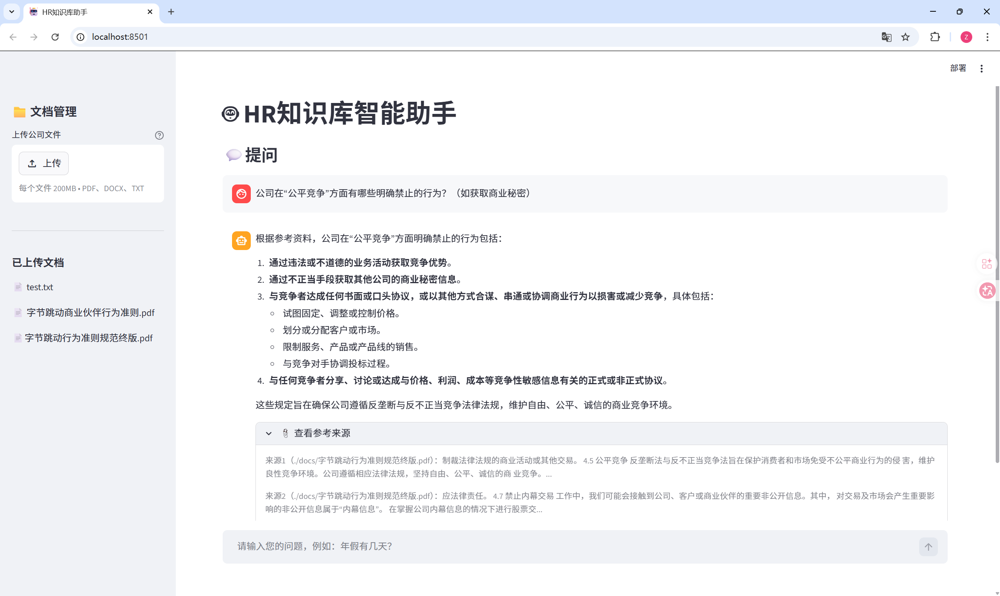

# HR知识库智能问答系统

基于 RAG（检索增强生成）架构的企业HR知识库问答系统，员工可以通过自然语言提问，系统自动从上传的公司文档中检索相关内容并给出准确答案。

## 项目演示




## 技术栈

- **前端**：Streamlit
- **后端**：FastAPI
- **向量数据库**：ChromaDB
- **嵌入模型**：BAAI/bge-small-zh-v1.5
- **大语言模型**：DeepSeek v3.2（兼容 OpenAI 接口）
- **框架**：LangChain

## 核心功能

- 支持上传 PDF、Word、TXT 格式的公司文档
- 基于语义相似度的文档检索
- 查询改写优化检索精度
- 流式输出，回答实时显示
- 多轮对话记忆，支持上下文理解
- 显示参考来源，答案可追溯

## 系统架构
```
用户提问
↓
查询改写（LLM将口语化问题改写为检索关键词）
↓
向量检索（bge-small-zh-v1.5 + ChromaDB）
↓
填入Prompt模板
↓
DeepSeek生成答案（流式输出）
↓
返回答案 + 参考来源
```
## 项目结构
```
hr-bot/
├── core/
│   ├── loader.py        # 文档加载与切块
│   ├── vectorstore.py   # 向量化与数据库管理
│   └── qa.py            # 问答核心逻辑
├── docs/                # 上传的文档存放目录
├── main.py              # FastAPI 后端
├── app.py               # Streamlit 前端
└── requirements.txt     # 依赖包列表
```
## 快速开始

**1. 克隆项目**
```bash
git clone https://github.com/你的用户名/hr-bot.git
cd hr-bot
```
**2. 安装依赖**
```bash
pip install -r requirements.txt
```
**3. 配置环境变量**
```bash
新建 .env 文件：
OPENAI_API_KEY=你的API Key
OPENAI_BASE_URL=https://api.deepseek.com
HF_TOKEN=你的HuggingFace Token
```
**4. 启动后端**
```bash
uvicorn main:app --reload --port 8000
```
**5. 启动前端**
```bash
streamlit run app.py
```
**6. 打开浏览器访问**
```bash
http://localhost:8501
```
##使用方式

1.在左侧上传公司文档（PDF/Word/TXT）

2.点击"开始解析"等待文档入库

3.在底部输入框输入问题

4.系统实时返回答案和参考来源

##优化亮点

-**查询改写**：用户口语化提问先经过LLM改写成更贴近文档语义的检索词，解决词汇不匹配问题

-**chunk_size调优**：中文文档切块大小设为300字，平衡语义完整性和检索精度

-**对话记忆**：保留最近3轮对话历史，支持"那怎么申请"这类上下文提问

-**流式输出**：基于FastAPI StreamingResponse实现，用户体验更流畅


